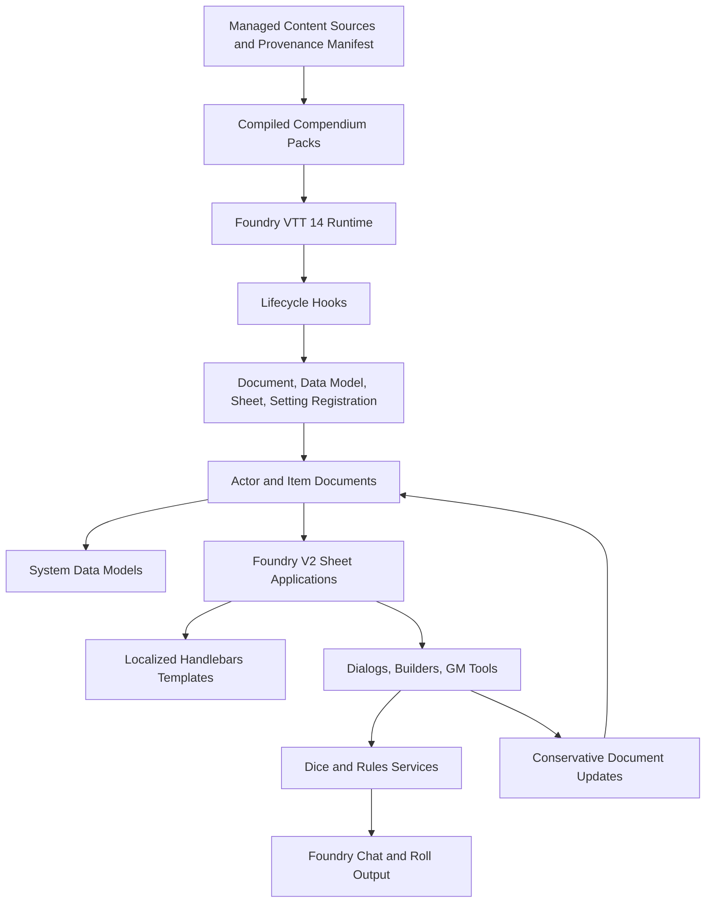
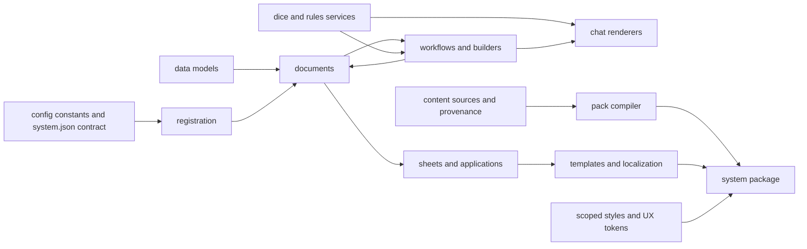
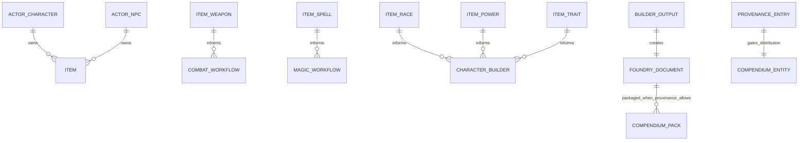
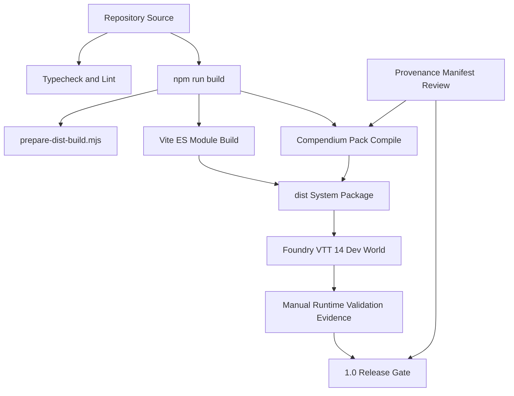

# Architecture Spine - UESRPG Rebuilt

## Design Paradigm

Foundry-native layered document architecture. Foundry owns runtime lifecycle, document persistence, permissions, sheets, chat, rolls, combat, compendia, tutorials, and packaging. UESRPG Rebuilt layers system behavior on top of those primitives rather than introducing a separate application or state model.



## Invariants & Rules

### AD-1 - Foundry Runtime Is The Application Boundary [ADOPTED]

- **Binds:** FR-1, FR-2, FR-34, NFR-1, all runtime features.
- **Prevents:** Feature teams building separate routing, state, document, or package behavior that cannot interoperate with Foundry documents, permissions, combat, chat, compendia, or lifecycle phases.
- **Rule:** Runtime behavior must be implemented as a Foundry VTT 14 system package using Foundry documents, data models, hooks, V2 application sheets, templates, localization, chat, rolls, combat, settings, compendia, tutorials, and package metadata. Runtime source must not depend on Node-only APIs, Vite-only behavior, or a separate browser app model.

### AD-2 - Document Type Changes Are Atomic Cross-File Changes [ADOPTED]

- **Binds:** FR-1, FR-4..FR-7, FR-20..FR-27, FR-31, NFR-6, NFR-7.
- **Prevents:** Actors or items that exist in one layer but fail at runtime because metadata, data models, sheets, templates, localization, styles, packs, build-copy rules, or migrations diverge.
- **Rule:** Adding or renaming an actor or item type requires a single coordinated change across centralized constants, `system.json` document types and HTML fields, data model registration, document/sheet registration, templates, localization keys, styles/assets, `vite.config.ts` static-copy coverage, migration handling for existing world data when needed, and validation evidence.

### AD-3 - Persisted State Mutates Only Through Foundry Documents

- **Binds:** FR-4..FR-19, FR-21, FR-27, FR-34, FR-35, NFR-3, NFR-4, NFR-7.
- **Prevents:** Hidden duplicated state, builder-only data, chat-only state, irreversible automation, or workflows that require raw JSON editing as the normal correction path.
- **Rule:** Actor, item, combat, and content state must be represented in Foundry documents and mutated through awaited Foundry document APIs. Updates must be path-based and conservative. High-risk or ambiguous combat, magic, advancement, builder, or content updates require user confirmation or clear manual control. Resulting state must remain inspectable and correctable through normal sheets where permissions allow.

### AD-4 - Rules Automation Uses Shared Services And Transparent Chat

- **Binds:** FR-8..FR-19, FR-28..FR-30, Rules Coverage Checklist sections 8..10 and 12, NFR-2, NFR-3.
- **Prevents:** Different sheets, dialogs, macros, combat actions, and builders implementing incompatible d100 math, critical handling, DoS/DoF, modifiers, missing-data behavior, or output shapes.
- **Rule:** Mechanical resolution must flow through shared dice/rules services before producing Foundry-native chat or roll output. The shared service owns the 1.0 d100 rules from the Rules Coverage Checklist: `d100 <= target number`, modifiers adjust target number, target number may exceed `100`, skill bonus is `10 * rank`, untrained skill penalty is `-20`, limited tests cap the primary skill rank, DoS/DoF and target-over-100 handling follow the checklist, player criticals use Lucky/Unlucky Numbers, and NPC/creature critical ranges default to `1-3` and `98-100` unless statblock data overrides them. Automated or semi-automated rolls must show actor/source, roll type, inputs used, target value when applicable, modifiers, raw roll, outcome, critical state, DoS/DoF when applicable, missing-data warnings, and manual adjudication notes when the system cannot safely decide.

### AD-5 - Builders Are Document Authoring Workflows

- **Binds:** FR-20..FR-27, FR-31..FR-33, SM-3, Rules Coverage Checklist section 11, NFR-4, NFR-6, NFR-7.
- **Prevents:** Wizard outputs that only exist inside transient UI state, require routine raw JSON editing, cannot open on sheets, cannot be used in play workflows, or cannot become package content when rights allow.
- **Rule:** Character creation, character advancement, spell creation, equipment, and statblock builders are full 1.0 builders. Enchanting and alchemy builders are minimal/deferred 1.0 builders. Rituals are manual/simple entity workflows for 1.0. Each builder must validate required inputs, create a valid Foundry document, open the resulting document on its sheet, preserve post-creation editability, and produce data usable by relevant play workflows. Builder-created content may enter compendium packaging only through the managed content/provenance workflow.

### AD-6 - System Content Requires Provenance Before Distribution

- **Binds:** FR-31..FR-33, FR-18, FR-29, FR-30, NFR-6, NFR-8, Rules Coverage Checklist sections 13..14.
- **Prevents:** Shipping unclear-rights, unauthorized scraped, unreviewed, AI-generated prepared user-facing content, or hand-edited generated packs as release source.
- **Rule:** Distributed System Content must originate from `packs-src` or another explicitly registered managed source and have a machine-readable Provenance Manifest entry with pack ID, entity ID, entity name, entity type/category, source/origin, rights status, human author/reviewer, review date, distribution allowed state, notes/limitations, and related builder/source file when applicable. Current public packs are not release-ready System Content until manifest-grade provenance exists and the pack workflow enforces or validates it. Generated packs and `dist` artifacts are build outputs, not hand-edited sources of truth.

### AD-7 - Sheet And Chat UI Stay Localized, Tokenized, And Foundry-Native

- **Binds:** FR-3..FR-19, FR-35, FR-37, NFR-1, NFR-5, NFR-9, UX Experience and Design spines.
- **Prevents:** Hardcoded user-facing strings, nonstandard navigation, broad global CSS overrides, inaccessible color-only outcomes, or ornate output that slows live play.
- **Rule:** Sheet/application classes prepare labels, derived display values, permission states, and safe fallbacks at the TypeScript-to-Handlebars boundary. Templates stay simple and localized. CSS remains scoped to `.uesrpg-rebuilt` or related system classes and uses the UX token model. Chat cards must prioritize concise mechanical transparency over decorative mini-sheet density. Sheets must preserve core actions and avoid horizontal scrolling for core fields when narrowed; keyboard traversal, visible focus states, accessible names/states, text-paired semantic colors, reduced-motion-safe transitions, and field-associated builder errors are part of the 1.0 accessibility floor. The UX Experience and Design spines are draft sources at authoring time; if they change materially, this spine must be updated before downstream implementation treats the changed UX rule as binding.

### AD-8 - Onboarding Uses Foundry Tutorial Guidance

- **Binds:** FR-37, SM-2, NFR-9, UX Experience tutorial cues.
- **Prevents:** Shipping only maintainer-facing docs or markdown that leaves common workflows dependent on Greybard's personal instruction.
- **Rule:** 1.0 onboarding must include concise docs plus Foundry Tutorial API guidance for required common workflows. Tutorial content must use localization, must not duplicate the PRD as public copy, and must follow the same human-review and AI-content constraints as other user-facing package text.

### AD-9 - Manual Fallback Is A Visible Workflow State

- **Binds:** FR-10, FR-15, FR-17..FR-19, FR-23..FR-24, FR-29..FR-30, Rules Coverage Checklist section 15.
- **Prevents:** Silent automation failure, false precision in ambiguous rules cases, or fallback paths that force raw JSON editing and break the balanced one-shot.
- **Rule:** Manual fallback is allowed only for rare rules edge cases, highly custom rituals/enchanting/alchemy/unusual magic, ambiguous combat, rights-limited content, or explicit GM judgment. It must be visible or discoverable in the relevant sheet, dialog, chat output, workflow text, or documentation; it must preserve normal playability for the balanced one-shot; and it must not replace core skill, characteristic, attack, defense, initiative, spellcasting, sheet, builder, or content workflows.

### AD-10 - Lifecycle Phases Own Their Work [ADOPTED]

- **Binds:** FR-1, FR-2, FR-34, FR-35, migrations, settings, public API, content/world-data work.
- **Prevents:** Accessing world collections before Foundry readiness, late registration of document classes/sheets/data models, or unstable public API exposure.
- **Rule:** `init` registers the intentional `game.uesrpg` public API, document classes, data models, applications, and settings. `setup` registers trackable attributes and setup-phase integrations. `ready` runs migrations and world-data operations. Public integration surface is limited to intentional `game.uesrpg` exports; internal module paths are private unless explicitly promoted and documented.

### AD-11 - Release Readiness Requires Runtime Evidence

- **Binds:** FR-34..FR-37, SM-1..SM-6, NFR-6, Rules Coverage Checklist section 16.
- **Prevents:** Treating TypeScript, lint, Vite, or pack compilation success as proof that Foundry sheets, workflows, compendia, tutorials, migrations, or package assets work in the real runtime.
- **Rule:** Release-relevant changes require baseline verification with `npm run typecheck`, `npm run lint`, and `npm run build`, plus manual Foundry VTT 14 validation evidence for affected sheets, workflows, document types, migrations, compendium packs, provenance manifest, documentation/tutorials, balanced one-shot coverage, and minimal-handholding pass. Evidence records Foundry version, world/test data, entity used, action performed, expected result, actual result, status, limitations, and follow-up story/issue when needed.

## Dependency Direction



Downstream implementation may depend inward on shared config, data models, documents, and rules services. Shared layers must not depend on concrete sheet classes, builder UIs, chat templates, or specific compendium entries.

## Consistency Conventions

| Concern | Convention |
| --- | --- |
| Naming | Keep system constants centralized in `src/module/config/constants.ts`; use Foundry document type IDs as the canonical IDs; use PascalCase for classes and camelCase for functions/variables; preserve established folder naming under `config`, `data`, `documents`, `applications`, `utils`, `dice`, `chat`, and `migration`. |
| Data and formats | Persist actor/item system data through `foundry.data.fields` schemas with explicit initial values and validation where feasible; use path-based document updates; represent release content provenance in a machine-readable manifest; keep generated packs and `dist` as outputs. |
| State and side effects | Await Foundry document updates and chat/message side effects; use `void` only for intentional fire-and-forget lifecycle startup; access world collections only at lifecycle phases where Foundry makes them available. |
| UI and localization | Resolve user-facing text through `lang/en.json` keys and `localize()`; prepare display state in `_prepareContext`; keep Handlebars templates simple; scope CSS under system classes and UX tokens; support default, missing, filled, editable, read-only, narrow-window, keyboard, focus, and reduced-motion states. |
| Content policy | Do not include AI-generated prepared user-facing package content. Every distributable content entry must have rights/provenance review before release inclusion. |
| Validation | Baseline commands are `npm run typecheck`, `npm run lint`, and `npm run build`; Foundry runtime validation is required for release-relevant sheet, workflow, migration, compendium, package asset, and tutorial changes. |

## Stack

| Name | Version |
| --- | --- |
| Foundry VTT compatibility metadata | 14 minimum / 14 verified in `system.json`; runtime evidence still required by AD-11 |
| System package | 0.1.0 |
| TypeScript | ^5.8.2 |
| Vite | ^6.2.2 |
| vite-plugin-static-copy | ^2.3.0 |
| fvtt-types | GitHub `League-of-Foundry-Developers/foundry-vtt-types#main` |
| npm package workflow | `package-lock.json` |

## Structural Seed

```text
src/
  uesrpg-rebuilt.ts        # Foundry lifecycle entrypoint and public API registration
  global.d.ts              # local Foundry/global type augmentation
  module/
    config/                # canonical system IDs, document type IDs, settings, trackable attributes
    data/                  # actor/item data models and shared schema fragments
    documents/             # UESRPG Actor and Item document classes
    applications/          # Foundry V2 sheets, dialogs, builders, GM tools, tutorials
    dice/                  # shared d100/rules calculation services
    chat/                  # chat-card rendering and roll transparency output
    migration/             # versioned world/document data migration work
    utils/                 # narrow utilities: localization, logging, references, guards
templates/
  actor/                   # actor sheet templates copied to dist
  item/                    # item sheet templates copied to dist
  chat/                    # chat-card templates copied to dist
styles/                    # scoped system CSS and UX tokens copied to dist
lang/                      # localization files copied to dist
packs-src/                 # current managed pack source root for traits, powers, and races
provenance/                # proposed manifest location when provenance workflow is implemented
packs/                     # generated compiled packs, not hand-edited source
dist/                      # generated package output
```



## Capability -> Architecture Map

| Capability / Area | Lives in | Governed by |
| --- | --- | --- |
| FR-1 Package registration and runtime contract | `system.json`, `src/uesrpg-rebuilt.ts`, `src/module/config`, registration modules, `vite.config.ts` | AD-1, AD-2, AD-10 |
| FR-2 Public system API | `game.uesrpg` initialization in `src/uesrpg-rebuilt.ts` | AD-1, AD-10 |
| FR-3 Localization-ready UI | `lang/en.json`, sheet/chat templates, application context preparation | AD-7 |
| FR-4..FR-7 Play document sheets | `src/module/data`, `src/module/documents`, `src/module/applications`, `templates/actor`, `templates/item`, `styles` | AD-2, AD-3, AD-7 |
| FR-8..FR-11 Core resolution automation | `src/module/dice`, roll/test workflows, `src/module/chat`, chat templates | AD-4, AD-9 |
| FR-12..FR-15 Combat support | Foundry combat integration, actor/item workflows, shared rules services, document updates, chat cards | AD-3, AD-4, AD-9, AD-11 |
| FR-16..FR-19 Magic, alchemy, mishaps | Magic item data, workflows, rules services, chat cards, rights-gated tables | AD-3, AD-4, AD-6, AD-9 |
| FR-20..FR-27 Guided workflows/builders | Foundry V2 applications/dialogs under `src/module/applications`, data models, document APIs | AD-3, AD-5, AD-7, AD-9 |
| FR-28..FR-30 GM tools | Foundry roll tables or system applications, item references, provenance-reviewed generation inputs | AD-4, AD-6, AD-9 |
| FR-31..FR-33 System content and compendia | `packs-src`, Provenance Manifest, pack automation, `system.json` packs | AD-5, AD-6, AD-11 |
| FR-34..FR-37 Validation, minimal handholding, docs/tutorials | npm scripts, Foundry runtime validation evidence, docs, Tutorial API integrations | AD-7, AD-8, AD-11 |
| UX Experience and Design spines | Application context, templates, chat cards, scoped CSS tokens | AD-7, AD-8, AD-9 |

## Operational Envelope



## Deferred

| Decision | Revisit when | Reason it can wait |
| --- | --- | --- |
| Exact numerical compendium content counts | Content audit or release-candidate planning begins | The Rules Coverage Checklist already binds balanced one-shot and typical campaign preparation coverage without requiring counts at architecture altitude. |
| Exact field-level breakdown for every derived resource/state value | Implementing character/statblock data model slices | The checklist binds coverage categories; per-field formulas need focused rules analysis and migration design. |
| Deeper enchantment mechanics | Enchanting builder or enchanted item implementation starts | 1.0 accepts minimal/deferred enchanting with visible manual fallback. |
| Deeper alchemy mechanics | Alchemy builder or potion/poison workflow implementation starts | 1.0 accepts minimal/deferred alchemy with visible manual fallback and mishap visibility where supported. |
| Deeper ritual automation | Ritual workflow moves beyond readable/editable/manual entity support | 1.0 accepts manual ritual resolution with entity support. |
| Detailed combat sub-procedures beyond initiative, attack, defense, state update, armor/shield/quality/effects handling | Combat implementation stories expose specific unresolved rule branches | The architecture binds visibility, conservative updates, GM override, and manual fallback; specific sub-procedure rules belong in focused implementation specs. |
| External publication and hosting flow | Release packaging/distribution work begins | Current architecture binds package build and validation; no separate deployment platform is required for the Foundry system source at this altitude. |
